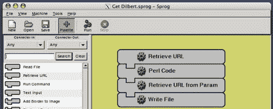

# 用 Sprog 进行数据操作

> 原文：<https://hackaday.com/2008/07/06/data-manipulation-with-sprog/>

Linux Journal 的【Mike Diehl】指出了一个[有趣的操纵数据的工具](http://www.linuxjournal.com/content/data-manipulation-sprog) : Sprog。 [Sprog](http://sprog.sourceforge.net/) 让你组装机器完成特定的数据处理任务。您将读取输入数据的齿轮连接在一起，以不同的方式处理数据，然后输出结果。输入可以是文件、URL、数据库查询结果，甚至是 MIDI 音符。对于处理，您可以匹配模式、选择 csv 列、转换成大写字母，或者执行任意 Perl 代码，还有许多其他选项。最后，输出可以显示在文本窗口中，插入数据库，写入文件，或发送到您的电子表格应用程序。Sprog 的网站有一个用户上传齿轮的部分和一个食谱部分，例如这个[纵横字谜解算器](http://sprog.sourceforge.net/recipes/crossword/index.html)。Sprog 所做的一切都可以通过脚本来完成，但这是一个简单的图形工具，可以帮助您解决问题，而不必了解背后的血腥机制。

*   [永久链接](http://www.linuxjournal.com/content/data-manipulation-sprog)