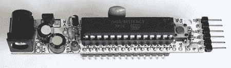

# 真正的裸机板 Arduino 克隆

> 原文：<https://hackaday.com/2008/07/06/really-bare-bones-board-arduino-clone/>

现代设备的[真的裸机板](http://www.moderndevice.com/RBBB_revB.shtml)是一个 [Arduino](http://www.arduino.cc/) 的克隆体，被设计成具有令人难以置信的小尺寸。它仅仅比必需的 AVR 宽一点，而且布局合理，所以你可以进一步减小尺寸。不需要电源连接器？把它剪下来。不需要电压调节器？很容易就能去除。该套件和所有通孔组件仅售 12 美元。[youevolve]发布了一个构建指南，展示了[组装](http://www.instructables.com/id/Assembling-the-Really-Bare-Bones-Board-RBBB-Ardu/)有多简单。

相关: [Freeduino SB 2.1 回顾](http://www.hackaday.com/2008/06/06/how-to-binary-clock-using-a-freeduino-sb-2-1/)

*   [永久链接](http://www.moderndevice.com/RBBB_revB.shtml)