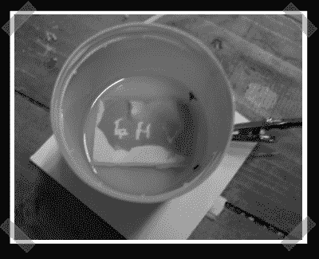

# 激光曝光 PCB 抗蚀剂

> 原文：<https://hackaday.com/2008/07/09/laser-exposing-pcb-resist/>

【Andre】第一次尝试使用 [HD-DVD 激光二极管曝光光敏抗蚀剂](http://4hv.org/e107_plugins/forum/forum_viewtopic.php.last)制造 PC 板。我们一直想用旧的 Epilog 激光切割机试一试。为了测试，他在板上涂了一些抗蚀剂，然后用激光手工曝光。最后，他用一些氢氧化钠蚀刻它。

*   [永久链接](http://4hv.org/e107_plugins/forum/forum_viewtopic.php?47964.last)