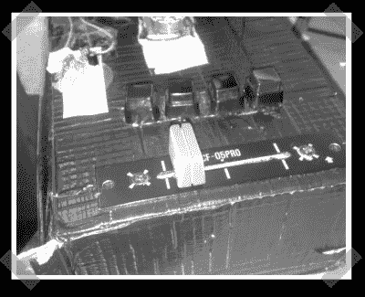

# 光学 DJ 控制器

> 原文：<https://hackaday.com/2008/07/10/optical-dj-controller/>

【艾德里安】[派来了这个](http://www.djtechtools.com/2008/07/07/power-to-the-little-people/)甜美的小光学 DJ 控制器。“转盘”由一张 CD 和一个编码器轮制成，编码器轮由一张激光打印的透明顶片制成。你可以从一个备用鼠标中获得一些光学设备，或者直接购买零件。PIC18F452 将所有内容编码成一个 midi 信号。你可以在这里找到原理图[的好照片](http://picasaweb.google.com/rasteri/Scratchtroller/photo#5216080810302030418)。休息之后你可以点击演示视频。

<object width="425" height="344"><param name="movie" value="http://www.youtube.com/v/T2j5OoIu5kw&amp;hl=en&amp;fs=1"><param name="allowFullScreen" value="true"></object>

*   [永久链接](http://www.djtechtools.com/2008/07/07/power-to-the-little-people/)