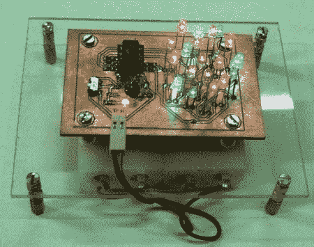

# 呼吸控制 led 蜡烛

> 原文：<https://hackaday.com/2008/07/11/breath-controlled-led-candles/>

Instructables 用户【cedtlab】贴出了一个有趣的 LED 项目[模拟生日蜡烛](http://www.instructables.com/id/S5KM1YXFIHEUXA2/)。该电路运行在一个 AVR ATTiny45 上，由 4 节 AA 或 AAA 电池供电。通过使用一种 [Charliplexing](http://www.instructables.com/id/Charlieplexing-LEDs--The-theory/) 技术，他们能够只用 ATTiny 的 5 个引脚驱动所有 20 个 led。热敏电阻用于通过测量温度变化来检测呼吸，然后 led 块根据检测到的变化关闭。他们提供了所有东西的原理图和源代码。休息之后，请务必观看“虚构的生日聚会”的视频。

 <https://www.youtube.com/embed/UBYuQnvVfzI?version=3&rel=1&showsearch=0&showinfo=1&iv_load_policy=1&fs=1&hl=en-US&autohide=2&wmode=transparent>

 <ul><li class="readlink"><a href="http://www.instructables.com/id/DIY-Electronic-Birthday-Blowout-Candles/">永久链接</a></li></ul> </body> </html>