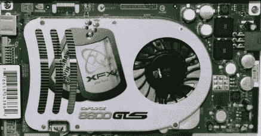

# 英伟达的问题比预期的更糟糕？

> 原文：<https://hackaday.com/2008/07/11/nvidias-problems-worse-than-expected/>

根据《问询者报》的一篇文章，很有可能[所有采用 G84 和 G86 架构的芯片都有故障](http://www.theinquirer.net/gb/inquirer/news/2008/07/09/nvidia-g84-g86-bad)。据说这个问题是过度的热循环，当 NVIDIA 被询问时，[他们把这个问题归咎于他们的供应商](http://www.theinquirer.net/gb/inquirer/news/2008/07/07/nvidia-meltdown-blame-game)。尽管 NVIDIA 声称只有惠普的[少数芯片受到影响，但《问询者报》指出，所有芯片都使用相同的 ASIC，这在架构的生命周期中没有改变。他们还指出，戴尔和华硕也有同样的问题。](http://h10025.www1.hp.com/ewfrf/wc/document?lc=en&cc=us&docname=c01087277&dlc=en)

文章接着从理论上解释了为什么我们没有看到更多的抱怨。他们说，这些类型的故障通常遵循分布在时间域上的钟形曲线，而我们只是在初始的上坡上。这可能是由于用户的不同使用模式。例如，使用笔记本电脑的人比使用台式机的人更频繁地开关电脑，从而促进了热量循环效应。他们建议快速修复更多的煽风点火，但最终 NVIDIA 将不得不做一些事情。

[via [Engadget](http://www.engadget.com/2008/07/10/all-nvidia-8400m-8600m-chips-faulty/)

*   [永久链接](http://www.theinquirer.net/gb/inquirer/news/2008/07/09/nvidia-g84-g86-bad)