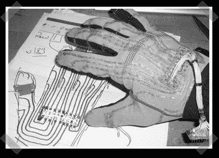

# Clove 2 手套，用于单手输入

> 原文：<https://hackaday.com/2008/07/12/clove-2-glove-for-one-handed-input/>

【克里斯多夫·米切尔】([《黑客一日》前情提要](http://www.hackaday.com/2007/08/16/vufan-vu-meter/))已经开发出一种相当有趣的输入设备。[Clove 2 手套是蓝牙数据输入接口](http://www.cemetech.net/projects/item.php?id=16)。目标是能够在不使用传统键盘的情况下“打字”。击键是通过手指运动实现的。你的电脑只是把它看作一个蓝牙 HID 设备，一些软件会为你翻译它。

虽然这看起来令人困惑，但他把它设计得非常类似于在键盘上打字。每个手指动作或组合都是一次击键。就像在普通键盘上打字一样，也有修改笔画，如 ALT 或 shift，会影响其他笔画。最常用的键需要最少的手指运动组合。

<object width="450" height="364"><param name="movie" value="http://www.youtube.com/v/qYXVf_6nsGQ&amp;hl=en&amp;fs=1"><param name="allowFullScreen" value="true"></object>
【Christopher】通过添加一些你起初可能没有想到的功能，使这个用户界面更加友好。例如，ALT 和 shift 键的工作方式类似于电话界面。当你按下它们时，下一次击键就会生效。还有音频反馈让你知道这已经发生了。每一次正常的击键都会发出一声滴答声，而每一个修饰键都有一个独特的音调。

他们也不吝啬信息。该网站有一个如何自己制作手套的完整记录。每一步都有详细的描述和图片以及可下载的原理图。

这种输入方式看起来是如此的不唐突。我们可以想象在仓库中，甚至在医生需要保持双手可用时，这种方法可以用于不同类型的输入。也许袜子版本应该是下一个！

*   [永久链接](http://www.cemetech.net/projects/item.php?id=16)