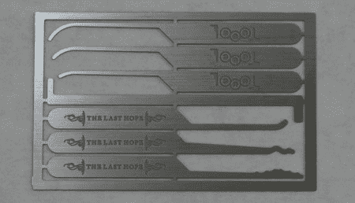

# 最后的希望

> 原文：<https://hackaday.com/2008/07/12/toool-picksets-at-the-last-hope/>

说到激光雕刻，blackbag 博客宣布 [Toool 今年为](http://www.toool.nl/blackbag/?p=209)[最后的希望](http://www.mahalo.com/The_Last_HOPE_Conference)设计了两个独特的镐组。首先是上面看到的信用卡大小的快照集。他们把这一个命名为最后的希望紧急镐。另一个镐组是“双面镐”系列的新版本。这一组由两端具有相同工具的镐组成，但它们的大小不同。这一套将包含 8 个承诺的改进精选。如果你对更复杂的镐感兴趣，看看蜈蚣。

*   [永久链接](http://www.toool.nl/blackbag/?p=209)