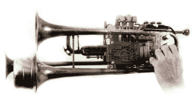

# 《最后的希望》的音乐和视觉艺术

> 原文：<https://hackaday.com/2008/07/12/music-and-visual-arts-at-the-last-hope/>

来自 Create Digital Music 的彼得·科恩(Peter Kirn)写了一篇文章，重点介绍了许多计划于周五晚上在[《最后的希望》](http://www.mahalo.com/The_Last_HOPE_Conference)举行的[音乐和视觉表演。如果你在纽约附近，不习惯于黑客会议，这可能是一个去看看的好借口。以下是一些我们最喜欢的项目。](http://createdigitalmusic.com/2008/07/12/we-are-hacks-music-and-visual-performance-at-hope-nyc-preview/)

<object width="450" height="339"><param name="allowfullscreen" value="true"> <param name="allowscriptaccess" value="always"> <param name="movie" value="http://www.vimeo.com/moogaloop.swf?clip_id=675162&amp;server=www.vimeo.com&amp;show_title=0&amp;show_byline=0&amp;show_portrait=0&amp;color=23C50B&amp;fullscreen=1"></object> 
在视觉领域，[Joshue Ott](http://www.intervalstudios.com/superdraw/)[Ezekiel Honig](http://www.ezekielhonig.com/)【预定展出。[Ott]以创作[super draw 而闻名，这是一款用于制作音乐视觉效果的神奇应用 T11。上面的视频展示了 superDraw 的实际应用。[Honig]将提供他常用的温暖和嘈杂的环境声景。](http://www.intervalstudios.com/superdraw/)

代表 8 位场景的 <object width="450" height="338"><param name="allowfullscreen" value="true"> <param name="allowscriptaccess" value="always"> <param name="movie" value="http://www.vimeo.com/moogaloop.swf?clip_id=714705&amp;server=www.vimeo.com&amp;show_title=0&amp;show_byline=0&amp;show_portrait=0&amp;color=23C50B&amp;fullscreen=1"></object> 
， [Paris](http://www.parisgraphics.com/) (以上视频)和[无载体](http://www.no-carrier.com/)也预定出席。

<object width="450" height="338"><param name="allowfullscreen" value="true"><param name="allowscriptaccess" value="always"><param name="movie" value="http://www.vimeo.com/moogaloop.swf?clip_id=926853&amp;server=www.vimeo.com&amp;show_title=0&amp;show_byline=0&amp;show_portrait=0&amp;color=23C50B&amp;fullscreen=1"></object>
[迈克尔·尤纳](http://vimeo.com/michaeluna)也将到场展示他的现场循环和机器人辅助表演。上面的视频展示了他将要表演的一个机器人。这个机器人是围绕[高流动性 MIDI 套件](http://highlyliquid.com/)打造的。

*   [永久链接](http://createdigitalmusic.com/2008/07/12/we-are-hacks-music-and-visual-performance-at-hope-nyc-preview/)