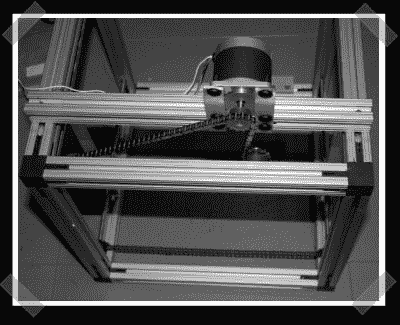

# FABR:另一个 3d 打印项目

> 原文：<https://hackaday.com/2008/07/13/fabr-another-3d-printing-project/>

【楼】一直在做自己的 3d 打印机: [fabr](http://www.ooeygui.com/?cat=7) 。我们发现它很有吸引力，因为入门费用比 reprap 之类的东西要低一些。80/20 没那么便宜，但是你不需要大型商用激光切割机来建造底盘。他使用的步进器看起来很便宜，可以从点阵打印机中回收。为了驱动它，他正在开发一种定制的微步进板，并希望最终开发出一种 Arduino 屏蔽来控制步进驱动器。没错，它会得到一个 Arudino 来充当 CNC 控制接口。

*   [永久链接](http://www.ooeygui.com/?cat=7)