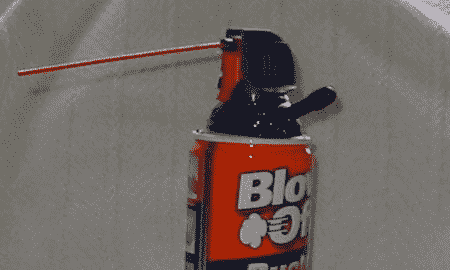

# 可再充装罐装空气

> 原文：<https://hackaday.com/2008/07/14/refillable-canned-air/>

虽然不是很专业，【3eff_Jeff】贴出了一个[有趣的改装，对一个空的空气罐](http://www.flickr.com/photos/7588301@N02/2665322979/)进行改装，使其可以重新灌装。他厌倦了在臭氧上钻孔，所以他小心翼翼地在罐子顶部钻了一个孔。为了谨慎起见，他先用橡皮筋绑住扳机，确保罐子完全空了。等了一会儿后，他小心翼翼地用润滑油钻了个洞，然后用环氧树脂把一个剩余的自行车轮胎内胎塞进了 Schrader 气门嘴。

由于空气被泵入罐中时被压缩，它变得相当热。他发现，如果让罐子冷却到室温，空气一旦离开罐子就会变得非常冷，这将导致冷凝问题。所以他一装满就用，不用的时候就倒空。

我们不建议任何人尝试这种方法，但这是一种独特的方法，可以使计算机领域中常用的一次性资源变得可重复使用。如果我们可以不止一次地使用某样东西，我们肯定会支持它。这就是为什么我们支持[回收部件](http://www.hackaday.com/2008/07/03/reusing-pcb-components/)，否则这些部件将被送往垃圾填埋场。

*   [永久链接](http://www.flickr.com/photos/7588301@N02/2665322979/)