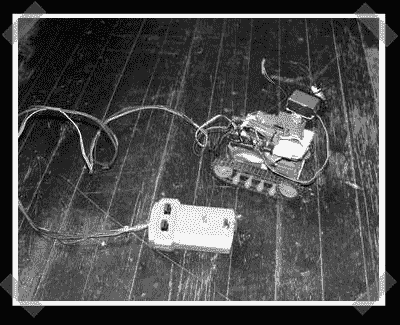

# Ard-e:廉价的 Arduino 机器人平台

> 原文：<https://hackaday.com/2008/07/14/ard-e-cheap-arduino-robot-platform/>

【亚当】派出他的机器人: [Ard-e](http://www.instructables.com/id/Ard-e-The-robot-with-an-Arduino-as-a-brain/) 。它是建立在一个便宜的遥控推土机套件以及一堆便宜的零件。他设法把成本控制在 100 美元以下。你可能会厌倦 Arduino，但是我们喜欢这个平台让微控制器新手不用高级汇编语言就能得到结果。

*   [永久链接](http://www.instructables.com/id/Ard-e-The-robot-with-an-Arduino-as-a-brain/)