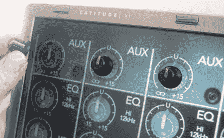

# sense surface:Lcd 屏幕上的自定义输入

> 原文：<https://hackaday.com/2008/07/15/sensesurface-custom-inputs-on-your-lcd-screen/>

【Lindsay Williams】提出了一种为你的程序构建定制物理输入的新颖方法。 [SenseSurface](http://girtonlabs.googlepages.com/sensesurface) 是[为每个应用构建新界面](http://www.hackaday.com/2008/07/09/custom-modular-control-interfaces/)的可行替代方案。只需将刻度盘、按钮和滑块放在屏幕上您想要的任何位置。

放置在显示器后面的传感器板从输入端拾取信号。可用输入数量的唯一限制是屏幕的大小。输入以磁性方式保持，并具有低摩擦背衬，以避免刮伤或擦伤您的屏幕。

<object width="450" height="364"><param name="movie" value="http://www.youtube.com/v/_26hBXbNsGY&amp;hl=en&amp;fs=1"> <param name="allowFullScreen" value="true"></object> 
下面是一个[演示视频](http://www.youtube.com/watch?v=_26hBXbNsGY)展示一键使用。当他们转动它的时候，它看起来一点也不滑动。我们很想尝试一下，看看它是什么样的，以及看到更多关于使用什么技术的信息。

[via [音乐之事](http://musicthing.blogspot.com/2008/07/sensesurface-attach-knobs-and-sliders.html)

*   [永久链接](http://girtonlabs.googlepages.com/sensesurface)