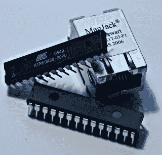

# ATmega88 网络服务器

> 原文：<https://hackaday.com/2008/07/15/atmega88-webserver/>

如果你是 Atmel 的粉丝，你可能会喜欢这个围绕 ATmega88 构建的网络服务器。因为它完全支持 TCP 和 HTTP，所以可以在任何系统上使用标准的 web 浏览器进行通信。我们还注意到代码使用 AVR Libc，处理器可以用 ATmega168 代替，两者都在 Arduino 平台上使用。老实说，我们认为这个项目最有趣的部分是固件。作者假设 web 服务器将只为每个请求发送一个包，并且代码针对这种设置进行了优化。这为 web 应用程序留下了大约 50%的内存。

[途径〔t0〕你的电子〔t1〕

*   [永久链接](http://tuxgraphics.org/electronics/200611/embedded-webserver.shtml)