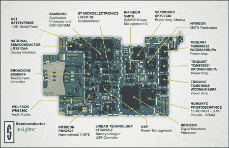

# IPhone 3G:引擎盖下

> 原文：<https://hackaday.com/2008/07/15/iphone-3g-under-the-hood/>

TechOnline 已经[破解了](http://www.techonline.com/product/underthehood/209000013?pgno=1)iPhone 3G，以找出它运行的原因。他们发布了详细的图表以及一些解剖的[视频](http://www.eetimes.com/news/latest/showArticle.jhtml;jsessionid=IE4DKPJUXWARIQSNDLSCKHA?articleID=209000009)。

他们称之为增量更新，他们注意到这些变化似乎是添加和改进，而不是对原始平台的完全重建。他们谈到了实质问题，不仅讨论了布局和结构，甚至讨论了每个芯片制造商的重要性。

有些改进是显而易见的，比如 3G。其他包括电池不是永久连接的，耳机插孔是齐平安装的。最大的变化是谁制造了每个芯片。

[途径[【tuaw】](http://www.tuaw.com/2008/07/15/3g-iphone-under-the-hood/)

*   [永久链接](http://www.tuaw.com/2008/07/15/3g-iphone-under-the-hood/)