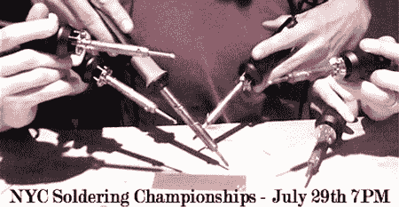

# 纽约焊接锦标赛

> 原文：<https://hackaday.com/2008/07/16/nyc-soldering-championships/>

【Matt】让我们了解一下[纽约市焊接锦标赛](http://www.nycresistor.com/2008/07/16/nyc-soldering-championships-july-29th/)。它们将在 7 月 29 日晚 7 点的[点火会谈](http://radar.oreilly.com/2008/07/ignite-nyc-soldering-guerilla.html)期间发生。25 个人将会争先恐后地组装一套功能齐全的电子设备。与会者必须提前登记，并鼓励携带自己的铁。工具还没选好，所以人们不能练习。我们希望他们至少考虑使用一些 SMD 器件，以保持趣味性。如果你打算参加或参加比赛，大声喊出来！

[图片:[尼克·比尔顿](http://www.flickr.com/photos/bre/2674997784/)

*   [永久链接](http://www.nycresistor.com/2008/07/16/nyc-soldering-championships-july-29th/)