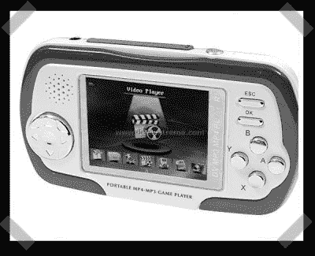

# 廉价的 ARM 彩色液晶平台

> 原文：<https://hackaday.com/2008/07/18/cheap-arm-color-lcd-platform/>

今天，[sprite_tm]让我们来了解一下他的一个[宠物项目](http://spmp305x.spritesserver.nl/wiki/index.php/Main_Page)。这是一款价格低廉的便携式游戏平台，售价约为 50 美元，碰巧使用了 ARM CPU 和 320×240 彩色 LCD。因为它太便宜了，他一直在对它进行逆向工程，并且已经有了一个概念验证[自制](http://spmp305x.spritesserver.nl/wiki/index.php/Homebrew)版本的 Pong 出来。
更新:是的，是的——标题固定。

*   [永久链接](http://spmp305x.spritesserver.nl/wiki/index.php)