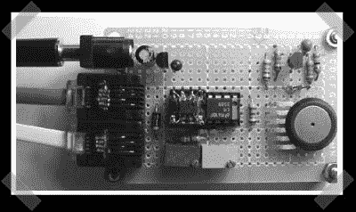

# 单线气压计

> 原文：<https://hackaday.com/2008/07/22/1-wire-barometer/>

【大卫】组装这个相当不错的[单线气压计](http://davidbray.org/onewire/barometer.html)。MPX4115 测量压力，而安装在 8 引脚 DIP 插座上的 SMD DS2438 提供单线接口。该文章包括对电路板布局和布线的详细描述，使这个项目对任何有烙铁相关知识的人来说都是可行的。

*   [永久链接](http://davidbray.org/onewire/barometer.html)