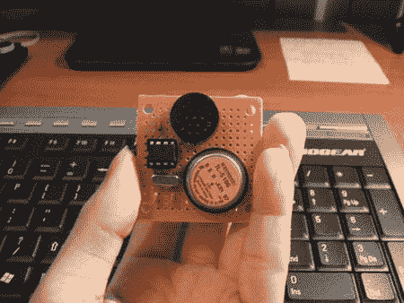

# 用高音调的噪音骚扰你的朋友

> 原文：<https://hackaday.com/2008/07/22/annoy-your-friends-with-high-pitched-noise/>

【Hungry _ Myst】组装了这个神奇的装置来[骚扰你的朋友](http://www.instructables.com/id/The-Raven-high-pitched-torture/)。它随机发出高音调的声音，然后停止一段时间，使它很难定位。他把噪音放在 17 千赫附近，使 30 岁以上的人几乎察觉不到，从而增加了额外的烦恼。事实上，不是房间里的每个人都能听到它，这让人们更加疯狂地试图找到它。

零件清单很短，说明也很简洁。这篇文章的奇妙之处在于，他鼓励人们去改进它。这本身并不是一件大事，但他提到了几个方面的具体增加，这将使它更加用户友好:开/关，音高控制和延迟控制。

相关:[jay]基于 Picaxe 的[大脑攻击者](http://haphazardhacks.blogspot.com/2006/04/brain-assailant-for-those-of-you.html)

*   [永久链接](http://www.instructables.com/id/The-Raven-high-pitched-torture/)