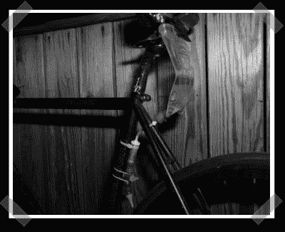

# 紫外线滴自行车追踪器

> 原文：<https://hackaday.com/2008/07/25/uv-drip-bicycle-tracker/>

【切-王巍】除了他的[气动动力服](http://www.hackaday.com/2008/05/23/real-life-power-suits/)之外，他的袖子上还有几个项目。这有点艺术化，但他发明了一个紫外线墨水滴管，在[骑车的任何地方留下一串隐形墨水](http://cwwang.com/2008/05/01/bikecrumbs-prototype-01/)。就当它是坏人汽车追踪系统下[MacGyver]油漆罐的现代化版本吧。

*   [永久链接](http://cwwang.com/2008/05/01/bikecrumbs-prototype-01/)