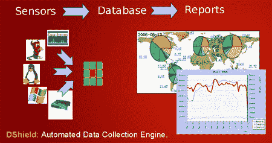

# 使用 DShield 的预测黑名单

> 原文：<https://hackaday.com/2008/07/25/predictive-blacklisting-with-dshield/>

[DShield 项目](http://www.dshield.org/indexd.html)希望通过[预测黑名单](http://arstechnica.com/news.ars/post/20080725-google-like-algorithm-creates-predictive-malware-blacklist.html)改变我们保护网络免受恶意软件攻击的方式。DShield 使用一种类似于 Google 的 PageRank 的方法，从网络管理员那里收集日志，以帮助开发一个基于恶意性的分数。他们将该分数与恶意软件已经攻击的位置信息相结合，以确定总体威胁级别。

与反病毒程序类似，该系统仍然依赖于被攻击的网络来评估威胁等级。他们已经证明，预测方法始终比人工黑名单更有效。该系统在过去的一年里一直免费提供。利用该系统的人报告了积极的结果。他们确实注意到，有一些人的网络基础设施与预测不太匹配。如果你想参加，去[他们的网站](http://www.dshield.org/indexd.html)注册。

*   [永久链接](http://arstechnica.com/news.ars/post/20080725-google-like-algorithm-creates-predictive-malware-blacklist.html)