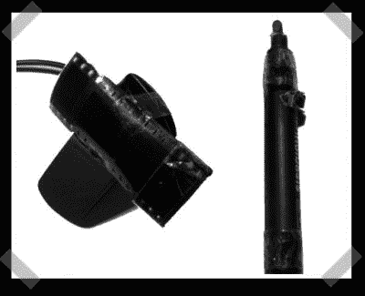

# 无线红外白板

> 原文：<https://hackaday.com/2008/07/28/wiimoteless-ir-whiteboard/>

【爱德华】提交了他的[红外网络摄像头白板项目](http://eduard.metzger.googlepages.com/webcam-whiteboard)。他想要类似于 [Wiimote 版本](http://wiiwhiteboard.wiki.sourceforge.net/)的东西，但是没有 Wiimote 的费用。他在相机上加了一些底片，以减少 CCD 接收到的可见光量。(他指出，你可能需要拔掉相机上的红外滤光片，才能获得良好的信号。)手写笔是带电源的常见红外 LED。为了完成实际的工作，他用 Java 编写了一个定制的应用程序。

*   [永久链接](http://eduard.metzger.googlepages.com/webcam-whiteboard)