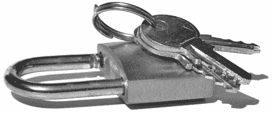

# 开锁和安全披露

> 原文：<https://hackaday.com/2008/07/28/lock-picking-and-security-disclosure/>

Slate 正在发表一篇[有趣的文章](http://www.slate.com/id/2195862)关于采用新的安全方法来锁定漏洞。在过去，像 Medeco 这样的锁制造商能够悄悄地更新他们的产品线以加强他们的安全性，但是随着像 [Locksport International](http://www.locksport.com/) 这样的运动越来越受欢迎，YouTube 上的开锁视频变得[一毛钱](http://youtube.com/watch?v=j77WM-uL4qc)一打[一打](http://youtube.com/watch?v=hbdfYyWpEpg)，锁制造商不能再靠默默无闻来获得安全性。毫无疑问，对这一领域兴趣的增加有助于锁制造商创造更安全的产品，但由于修补这些缺陷往往意味着改变锁的关键特征，这就成为一场非常昂贵的猫捉老鼠的游戏。

传统的开锁技术使用撬锁工具，比如在[最后的希望](http://www.thelasthope.org/)出售的[信用卡大小的一套](http://www.hackaday.com/2008/07/12/toool-picksets-at-the-last-hope/) ~~分发~~，但是最近的开锁方法使用[撞匙](http://www.hackaday.com/2008/05/19/bump-key-experiments/)或者甚至[磁铁](http://www.hackaday.com/2008/06/22/ring-of-the-devil-vulnerability-patched/)。然而，随着制造商使他们的锁更不容易被撬开和碰撞，即使是高安全性的锁也无法阻止决心复制钥匙的人，无论是通过观察原件还是使用印象，正如 Barry Wels 最近在 HOPE 2008 的一次演讲中所提到的。

*   [永久链接](http://www.slate.com/id/2195862)