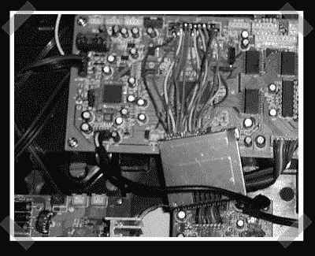

# 黑客电子动画猫王

> 原文：<https://hackaday.com/2008/07/31/hacking-animatronic-elvis/>

【斯科特】给我们拍了一个关于[黑掉 Wowee 制作的那些令人毛骨悚然的](http://www.robocommunity.com/forum/thread/13761/Elvis-Cartridge-has-been-hacked-updated-Article-is-on-the-way/)[【猫王】头像](http://www.wowweealiveonline.com/elvis/index.html)的一些进展的提示。头部使用一个闪存盒来存储用于运动/音频控制的所有数据。盒式存储器使用 NAND 闪存，因此对 XD 闪存卡读卡器的快速焊接工作产生了一个有用的存储盒转储——碰巧是 fat32 格式的。仍然有大量的工作要做，但是用定制的音频和动作命令替换数据似乎是微不足道的。

*   [永久链接](http://www.robocommunity.com/forum/thread/13761/Elvis-Cartridge-has-been-hacked-updated-Article-is-on-the-way/)