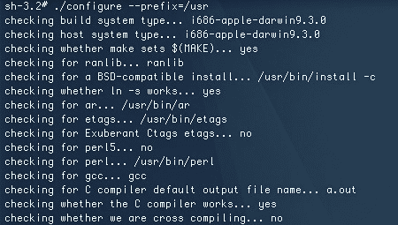

# 保护 OSX 上的 DNS

> 原文：<https://hackaday.com/2008/07/31/securing-dns-on-osx/>

【丹·卡明斯基】公布了 [DNS 漏洞](http://www.hackaday.com/2008/07/08/major-dns-issue-causes-multivendor-patch-day/)的性质，并允许在漏洞细节公开前 30 天不披露补丁程序，这已经过去几周了。不幸的是，细节早在就被[泄露了，没过多久，一个功能漏洞就](http://www.linuxjournal.com/content/understanding-kaminskys-dns-bug)[发布到了野外](http://www.hackaday.com/2008/07/23/dns-exploit-in-the-wild/)。从那以后，许多 ISP 采取措施防止他们的用户成为攻击的受害者，并且广泛使用的 DNS 协议实现 BIND 被更新以最小化威胁。即使在那个时候，也有报道称，AT & T 的 DNS 服务器上正在积极使用[版本的攻击。](http://computerworld.com/action/article.do?command=viewArticleBasic&taxonomyName=cybercrime_and_hacking&articleId=9111098&taxonomyId=82&intsrc=kc_top)

Mac OSX 使用 BIND 实现，但截至目前，苹果还没有发布更新系统的补丁(另一方面，微软在 7 月 8 日修补了这个补丁)。因此，运行 OSX 的机器面临被利用的风险。个人用户[不太可能成为目标](http://db.tidbits.com/article/9706)，因为攻击是针对服务器的，但是让这个漏洞开放并不是一个明智的想法。[Glenn Fleishman]已经[发布了一种手动更新 BIND 的方法](http://db.tidbits.com/article/9714)，而不是等待苹果自己修补。它需要 Xcode 和一些终端工作，但这是一个相对容易的更新。当我们尝试时，“make test”步骤跳过了一些测试，并告诉我们运行“bin/tests/system/ifconfig.sh up”。这使得我们可以重新运行测试，并继续更新，而不会受到进一步的干扰。[Fleischman]警告说，手动更新 BIND 的人可能会破坏官方更新，但他会在出现任何可能的变通办法时更新他的说明。不幸的是，这个修复只适用于 10.5 版本，但是[替代的、效率更低的方法](http://chuqui.typepad.com/chuqui_30/2008/07/secure-your-dns.html)可能适用于 10.4 和更早的版本。

如果您想知道您的首选 DNS 服务器是否易受攻击，您可以使用 Doxpara 的 [DNS checker 工具](http://www.doxpara.com/)。作为 ISP DNS 服务器的替代，你可以使用 [OpenDNS](http://www.opendns.com/) ，因为它的安全特性和配置选项，很多人更喜欢它。

*   [永久链接](http://db.tidbits.com/article/9714)