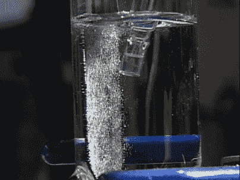

# 水基储能的突破

> 原文：<https://hackaday.com/2008/07/31/breakthrough-in-water-based-energy-storage/>

[丹尼尔·诺切拉](http://web.mit.edu/chemistry/www/faculty/nocera.html)[麻省理工学院能源倡议](http://web.mit.edu/mitei/)合作，想出了一种简单而廉价地将太阳能发电产生的能量储存在水中的方法。该方法使用两种无毒且丰富的金属催化剂将水分离成氧气和氢气。这些气体随后被储存起来，然后在燃料电池中重新混合以产生电能。这一过程受到光合作用的启发，有助于使太阳能等能源全天候可用。目前的存储技术既昂贵又低效，所以像太阳能这样的技术只有在能源可用的情况下才有用。这将使家庭能够廉价而方便地储存太阳能和其他技术产生的电能。虽然这只是解决当前能源问题的一部分，但它可以大大减少我们对不可再生资源的使用。当结合该领域的其他新突破时，你可以很容易地想象更多的家庭脱离电网。休息之后看看短片。