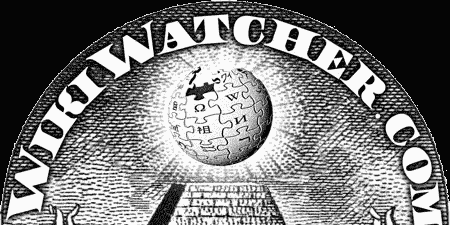

# Wikiwatcher 的新特性

> 原文：<https://hackaday.com/2008/08/01/new-features-on-wikiwatcher/>

维基观察者刚刚[正式发布了他们的新工具](http://wikiwatcher.com/)。上个月，我们[在](http://www.hackaday.com/2008/07/18/hoap-2008-wikiscanner-2-0/)[报道了他们的声明](http://www.mahalo.com/The_Last_HOPE_Conference)《最后的希望》。Wikiscanner 的 2.0 版本还没有准备好。

[穷人的支票用户](http://wikiwatcher.virgil.gr/pmcu/)曝光了相当一部分用户账号的 IP。这里有大量的数据可以作为你自己工具的基础。 [Potential Sockpuppetry](http://wikiwatcher.virgil.gr/psp/) 就是使用这种数据的一个很好的例子；它显示了哪些 IP 与多个帐户相关联，并且可以由同一个人运行。它从穷人的 Checkuser 获取数据，并按组织和 IP 范围进行排列。 [Beaver Scope](http://wikiwatcher.virgil.gr/beaverscope/) 密切关注来自麻省理工学院校园所有特定地点的编辑。作者在[加州理工学院-麻省理工学院恶作剧季](http://slashdot.org/articles/06/04/06/1551202.shtml)期间使用[这份麻省理工学院知识产权](http://wikiwatcher.virgil.gr/beaverscope/networks.txt)清单来监控麻省理工学院的活动。它能够准确地指出一篇文章是从哪栋大楼被编辑的。该团队希望看到人们从穷人的 Checkuser 数据中开发新工具。

*   [永久链接](http://wikiwatcher.com/)