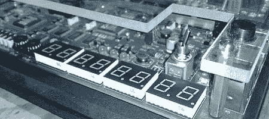

# 苹果牛顿开发套件？

> 原文：<https://hackaday.com/2008/08/03/apple-newton-dev-kit/>

【phooky】三年前发现了这个奇怪的开发硬件，但并不确定它是什么。它有许多通用开关、发光二极管和音频插孔。处理器是 ZIF 插座中的一个强 ARM 芯片。它有两个串行端口，一个 CF 和 PCMCIA 插槽。评论者[Glen Raphael]说，它看起来很像苹果 Newton 的早期原型开发板，也使用了 StrongARM 芯片。这绝对是一段有趣的历史。请务必检查纽约电阻器上的[完整项目。](http://www.nycresistor.com/2008/08/01/help-me-id-this-device/)

*   [永久链接](http://www.nycresistor.com/2008/08/01/help-me-id-this-device/)