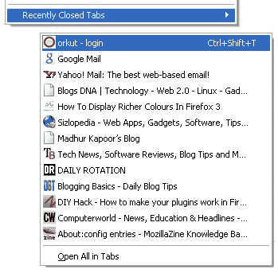

# 关于:火狐 3 的配置技巧

> 原文：<https://hackaday.com/2008/08/03/aboutconfig-hacks-for-firefox-3/>

Blogs DNA has some great suggestions for [tweaking the Firefox 3 about:config file](http://www.blogsdna.com/372/21-aboutconfig-hackstweaks-for-firefox-3.htm). Customize [Firefox 3](http://www.mozilla.com/en-US/firefox/all.html) to your particular preferences with hacks to reduce the number of auto-complete list in your URL bar, extend spell check to forms, and disable blinking text. All it takes is a few simple modifications to the [about:config](http://kb.mozillazine.org/About:config) file. By editing the about:config file, you can have a Firefox 3 that is faster, less bloated, and more tailored to your browsing habits. Do you have any suggestions for tweaks to Firefox 3?

[via [Digg](http://digg.com/software/21_About_Config_Hacks_Tweaks_For_Firefox_3_6)

*   [永久链接](http://www.blogsdna.com/372/21-aboutconfig-hackstweaks-for-firefox-3.htm)