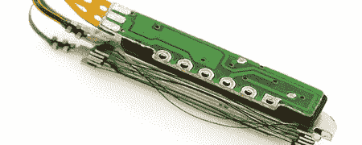

# 来自 SparkFun 的新消息

> 原文：<https://hackaday.com/2008/08/03/new-from-sparkfun/>

SparkFun 是[每周推出有趣的东西](http://www.sparkfun.com/commerce/news.php?id=179)一起玩。他们增加了一个[纳米肌肉](http://www.sparkfun.com/commerce/product_info.php?products_id=8782)致动器，该致动器使用形状记忆合金来提升其自身重量的近 70 倍。他们的 LilyPad 系列已经扩展到包括[小型瞬时开关](http://www.sparkfun.com/commerce/product_info.php?products_id=8776)和[热敏电阻型温度传感器](http://www.sparkfun.com/commerce/product_info.php?products_id=8777)。最后，他们有一个[调频接收模块](http://www.sparkfun.com/commerce/product_info.php?products_id=8770)。它只需要一个天线，并使用 I2C 或 SPI 进行控制。

*   [永久链接](http://www.sparkfun.com/commerce/news.php?id=179)