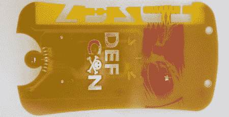
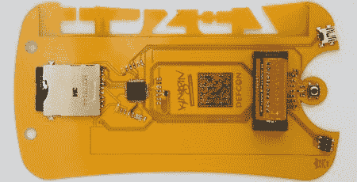

# 防御状态 16:徽章细节发布

> 原文：<https://hackaday.com/2008/08/05/defcon-16-badge-details-released/>

[防御状态](http://www.mahalo.com/Defcon)将再次提升与会者徽章的复杂程度。《连线》杂志刚刚发布了今年徽章的[预览。内核是 Freescale Flexis MC9S08JM60 处理器。徽章正面有一个红外发射器和接收器，外加八个状态 led。在背面(如下图)，有一个模式选择按钮，CR123A 电池，数据矩阵条形码和一个 SD 卡插槽。您可以在徽章上添加一个 USB 端口，并使用内置的 USB 引导程序上传代码。所有需要的开发工具都将包含在会议 CD 中，或者您可以提前](http://blog.wired.com/27bstroke6/2008/08/exclusive-defco.html)[下载 IDE](http://www.freescale.com/webapp/sps/site/homepage.jsp?nodeId=012726)。低准入门槛应该会导致一些有趣的黑客行为。前几年，你需要一个特殊的加密狗来编程硬件。没有迹象表明该徽章开箱后有什么作用。提前发布徽章是 Defcon 的第一次，图中的不是与会者的颜色，但我们肯定有人会提出一个克隆。

现在有趣的部分来了:你认为这个徽章的最佳用途是什么？Defcon 会如此漫不经心地给会议中的每个人都配备一台 TV-B-Gone 吗？我认为我们最喜欢的可能性是，如果有人发现一个安全漏洞，并设法编写一个基于 IR 的蠕虫来接管所有的徽章。

Defcon 14 推出了第一个电子徽章，它以不同的模式闪烁。Defcon 15 有一个 [95 LED 滚动字幕](http://www.grandideastudio.com/portfolio/defcon-15-badge/)。开幕式后，[乔·格兰德]将会在他的网站上发布更多具体的 Defcon 16 徽章细节[。在 Wired](http://www.grandideastudio.com/portfolio/defcon-16-badge/) 上查看更多高分辨率照片[。](http://blog.wired.com/27bstroke6/2008/08/exclusive-defco.html)

【图片:[戴夫·布洛克](http://davebullock.com/)

*   [永久链接](http://blog.wired.com/27bstroke6/2008/08/exclusive-defco.html)