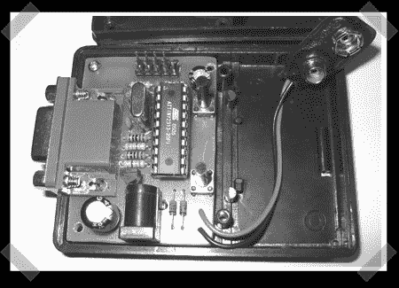

# 微型监视器测试仪

> 原文：<https://hackaday.com/2008/08/05/deogen-tiny-monitor-tester/>

[Deogen](http://www.eosystems.ro/deogen/deogen_en.html) 是一款小型独立设备，用于测试显示器。它是在 2000 年设计的，旨在减少在计算机商店测试显示器所需的空间和工作量。最初的设计使用 AT90S1200 微控制器来产生监视器的测试模式。它的大小和一个便携式 CD 播放器差不多，很容易带到任何显示器上并插上电源进行测试。

该设备的第二版，如上图所示，要小得多，大约是信用卡的宽度和高度。深度略大于 9 伏电池。与我们运行的上一个 vga 测试项目相比，这个项目很小。该单位拥有一套体面的功能，如；四种不同分辨率、电池或 DC 电源以及小尺寸的八种测试模式。

版本 2 的处理器是 20MHz 的 ATtiny2313，直接控制 H 同步和 V 同步信号。使用电阻网络将 RGB 转换为模拟信号。电源电路是为低功耗定制的，尽管他们指出可以使用 78L05 等效单元来代替它。

PCB 平面图和软件可从他们的网站上获得。去看看它的一些照片吧。

[谢谢，菲利普·菲茨杰拉德]

*   [永久链接](http://www.eosystems.ro/deogen/deogen_en.html)