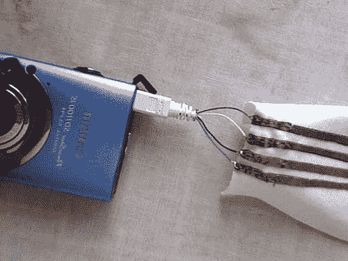

# 制作一根有弹性的织物 USB 线

> 原文：<https://hackaday.com/2008/08/15/make-a-stretchy-fabric-usb-cable/>

如果你一直困惑于如何用一种谨慎、耐用的方式将电线缝进衣服里，那就别再困惑了:[Plusea]已经整理出一篇文章，详细介绍了如何用有弹性的棉布制作一根 [USB 线](http://www.instructables.com/id/USB_Stretchy_Fabric_Connection/)。虽然详细的设计并没有给本发明带来多少实际用途，但我们可以想出几种非常有效的方法来开发这种玩具。想象一下，例如，将 [USB 电池组](http://www.boxwave.com/products/batteryadapter/)放入夹克的一个口袋，将[便携式数字音频记录器](http://www.m-audio.com/products/en_us/MicroTrackII-main.html)放入另一个口袋，将[领夹式麦克风](http://www.radioshack.com/product/index.jsp?productId=2102927)放入衬里，从而实现数十小时的秘密音频监控。

*   [永久链接](http://www.instructables.com/id/USB_Stretchy_Fabric_Connection/)