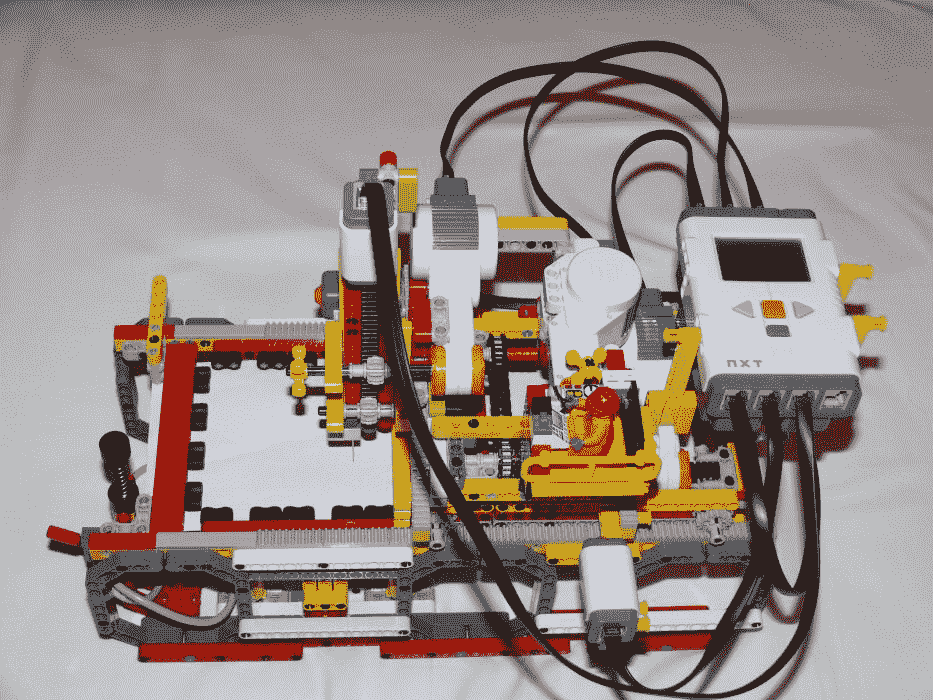
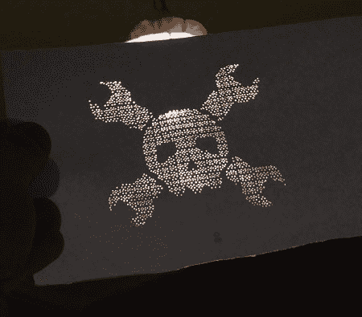

# 完全由乐高制成的绘图仪

> 原文：<https://hackaday.com/2008/08/15/plotter-made-entirely-from-lego/>

看看这个由【Alfonso Martone】建造并写信告诉我们的令人敬畏的工具:一个完全由乐高制成的[针式绘图仪(除了在一块砖上增加了一个针)。[Alfonso]已经设法获得了 33dpi 的分辨率和 90x70mm 毫米的“可打印”区域。NXT 设备读取 PBM 格式的 1 位位图图像，并输出到一张纸上，由乐高气动装置推压橡胶乐高积木固定。不过，输出并不是你所说的快速:输出一幅有 1500 个洞的画需要 35-40 分钟。](http://www.alfonsomartone.itb.it/naxntb.html)

【Alfonso】成功地用这件令人敬畏的作品俘获了我们的心，我们很想把它装在背景灯里，挂在墙上。

[谢谢，阿方索·马通]

*   [永久链接](http://www.alfonsomartone.itb.it/naxntb.html)