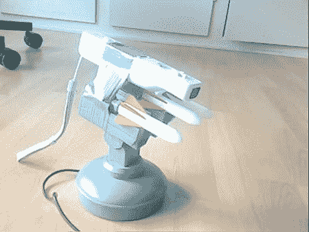

# Wiimote 导弹发射器

> 原文：<https://hackaday.com/2008/08/15/wiimote-missile-launcher/>

【toelle】通过让 Wiimote 自动瞄准他的 [USB 导弹发射器](http://www.instructables.com/id/Hack_your_usb_missile_launcher_into_an_quotAuto_/)展示了它的另一种用途。材料清单非常简单:一个 Wiimote，一个电动 USB 导弹发射器，一些胶带和[手套](http://carl.kenner.googlepages.com/glovepie_download)。

只需将 Wiimote 粘在导弹发射器上，安装 glove pie，然后按照他的指示编写一些自定义代码，就可以开始了。他深入探讨了如何将 Wiimote 连接到 PC，以及自定义代码如何工作的细节。它现在只能跟踪红外目标，这有点令人失望，但它能看到电视遥控器，对吗？

有没有什么方法可以将它与我们在 7 月报道的[声纳控制导弹发射器](http://www.hackaday.com/2008/07/27/sonar-controlled-usb-missle-launcher/)结合起来？

【通过[黑客 n 对](http://www.hacknmod.com/displayMOD.php?hack=1625)

*   [永久链接](http://www.instructables.com/id/Hack_your_usb_missile_launcher_into_an_quotAuto_/)