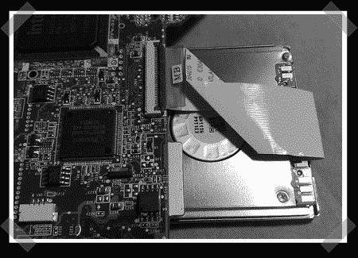

# 宏碁 Aspire One 硬盘升级

> 原文：<https://hackaday.com/2008/08/16/acer-aspire-one-hard-drive-upgrade/>

[如承诺的](http://www.hackaday.com/2008/08/14/modding-the-acer-aspire-one-with-bluetooth/)，【tnkgrl】发布了宏碁 Aspire One 升级的[第二部。在第一部分，她增加了蓝牙和更多的内存。这一次，她把重点放在了储物上。subnotebook 出厂时配有 8GB 固态硬盘。基于闪存的存储很容易从小型 ZIF 连接器中拔出。[tnkgrl]用从 iPod 中回收的 60GB PATA 三星硬盘替换了它。这是一个 1.8 英寸的磁盘，只有 5 毫米厚，所以它可以塞在主板下。知道它以前的用途，它应该证明相当有弹性。你可以在 Flickr](http://tnkgrl.wordpress.com/2008/08/16/modding-the-acer-aspire-one-hard-drive/) 上观看交换和[更多照片的](http://www.flickr.com/photos/tnkgrl/sets/72157606718788110/)[视频。](http://qik.com/video/183950)

接下来是第三部分，她将添加 3G 支持。

*   [永久链接](http://tnkgrl.wordpress.com/2008/08/16/modding-the-acer-aspire-one-hard-drive/)