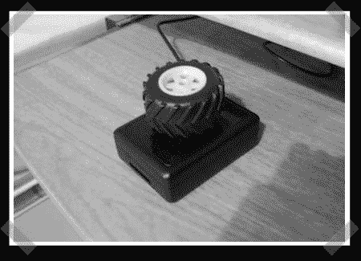

# 刮擦式滚轮

> 原文：<https://hackaday.com/2008/08/17/scratch-built-jog-wheel/>

【whatsisface】送来了他的[一只狮鹫队友](http://www.instructables.com/id/Desktop_Scroll_Wheel_and_Volume_Control/)的克隆体。 [PowerMate](http://www.griffintechnology.com/products/powermate) …只是一个大旋钮，所以很容易理解为什么不止一个人尝试过这个。[whatsisface]的灵感来自一个有点科技的帖子，它做了几乎相同的事情[，只是他们用了录像机的头部作为旋钮。所有其他组件，如光学编码器，都是从鼠标中抢救出来的，我们在](http://forums.bit-tech.net/showthread.php?t=86820)[我们的清理指南](http://www.hackaday.com/2008/05/16/how-to-scavenge-a-mouse-for-parts/)中谈到过。他用一个钢筋混凝土汽车轮胎作为实际的旋钮。虽然我们肯定它在泥土中工作很好，但我们可能会用 VCR 头的重量和惯性来代替。请看下面的视频，了解旋钮与 [Volumouse 软件](http://www.nirsoft.net/utils/volumouse.html)一起使用。

<http://www.youtube.com/v/M1N7ucyC9hg&amp;hl=en&amp;fs=1&amp;rel=0&amp;color1=0x3a3a3a&amp;color2=0x999999>

*   [永久链接](http://www.instructables.com/id/Desktop_Scroll_Wheel_and_Volume_Control/)