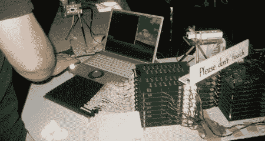

# SIGGRAPH 2008:追求更多像素

> 原文：<https://hackaday.com/2008/08/20/siggraph-2008-the-quest-for-more-pixels/>

*早在我们开始报道[ [丹·卡明斯基](http://www.doxpara.com/)】的 [DNS 诈骗](http://www.hackaday.com/2008/08/06/black-hat-2008-dan-kaminsky-releases-dns-information/)之前，他[贡献了一篇关于我们最喜欢的新技术来源之一的客座博文](http://www.hackaday.com/2005/09/02/siggraph-best-of-2005/):[SIGGRAPH](http://mahalo.com/SIGGRAPH)。星星再次排成一行，我们很高兴为您带来他对今年大会的分析。[图片: [Phong Nguyen](http://flickr.com/photos/phongnguyen/2759446078/) ]*

所以，上周，我有幸被刺伤，被扫描，被物理模拟，被合成散焦。显然，我一定是在 SIGGRAPH 2008，世界上最大的计算机图形会议。虽然它通常与黑帽冲突，但今年我实际上来了，尽管有点感冒使我无法享受我想要的那么多。尽管如此，我还是去了展厅，而且[文件(和视频)都在网上](http://kesen.huang.googlepages.com/sig2008.html "Siggraph 2008 Papers")，所以我确实写了这份(与 DNS 和安全无关的)报告。

SIGGRAPH 每年都会带来来自世界各地的技术演示，今年也不例外。各种形式的触觉模拟(还记得力反馈吗？)被展出。到目前为止，我体验过的最好的触觉模拟是一个机器人手臂，它可以“感觉”到它实际上有 3 磅或 30 磅重。今年有几个非常棒的参赛者。到目前为止，最好的是 Butterfly Haptics 的磁悬浮系统，它设法在碗中创建了一个小的垂直“冰球”，可以对任意的磁力和障碍立即做出反应。他们实际上有两个并排的冰球，连接到 OpenGL 物理模拟。你手中的两个冰球变成了多边形操场上的刚性平台。你碰到的任何东西，你能感觉到，你举起的任何东西，都会有重量。信不信由你，它实际上*工作*，远远好于它有任何权利。最令人印象深刻的是，如果你把你的现实世界中的平台互相推压，你会直接感受到每只手施加在另一只手上的力，就好像有一根现实世界中的杆子把两者连接起来。右手放松一点，左手就不会那么用力了。其他一切都令人印象深刻，但这是我见过的第一次触觉模拟，欺骗我的感官感知现实世界中的身体关系。酷！

同样有趣的是:[Takayuki iwa moto 等人的超声波发射器](http://www.siggraph.org/s2008/attendees/newtech/9.php "Airborne Ultrasonics")实际上能够通过超声波干涉在空气中创建独立的湍流区域。真的只是感觉有点抖风(就？)，但它离显示技术的圣杯“莱娅公主”又近了一步。

最佳廉价技巧奖授予了叠加动态范围的家伙。高动态范围图像捕捉和显示的工作量非常大，可以处理人眼能够处理的全部光强。人们也有很多投影图像的乐趣，用相机来看被投影的东西，然后在此基础上改变投影。这些人继续前进，他们没有把投影仪和照相机混合在一起，而是把它和打印机混合在一起。纸张具有很强的反射性，但打印机墨粉却没有，因此他们用激光打印输出及其主动显示的图像创建了一个共享显示。我在 x 光片上看到了这些影响——我不得不说，相当有说服力。不要期望动画会很快出现，尽管(附注:我确实问过他们关于电子纸的问题。他们试了一下，说还可以，但是对比度没那么大。)
<object width="450" height="364"><param name="movie" value="http://www.youtube.com/v/SS_ELjbDTOo&amp;hl=en&amp;fs=1&amp;rel=0"> <param name="allowFullScreen" value="true"></object>

永远酷:看到自己喜欢的谈资产品化。前几年我最喜欢的一次演讲是在斯坦福进行的——[合成孔径共焦成像](http://graphics.stanford.edu/papers/confocal/ "Synthetic Aperture Confocal Imaging Paper")。这些家伙将几十个廉价的小型快速摄像头的输出统一起来，实际上整合了一切，从矩阵风格的子弹时间到重新聚焦图像的能力——到能够看到“周围”遮挡物体的程度。因此，灰点灰研究公司，各种令人敬畏的相机设备的制造商，[不得不将一个 5×5 的相机阵列放在一起，并通过 PCI express](http://www.ptgrey.com/products/profusion25/index.asp "5x5 Point Grey Camera") 将它们连接起来。哦，实现合成孔径重新聚焦代码，实时，在他们的展台演示，用 Wii 控制器控制。太棒了。

当然，SIGGRAPH 的一些最酷的东西是为所有与会者保留的，在论文区。然而，他们在 SIGGRAPH 做的一件好事是要求每个人制作五分钟的研究视频。当每个人所研究的东西，几乎按照定义，在视觉上引人注目时，这是很有意义的。因此，每年，我都会去凯-黄森收藏的 SIGGRAPH 论文库看一看 SIGGRAPH 的最新成果。现在，我有自己的偏见:我从来都不是一个 3D 建模师，但我开始在 Photoshop 中做了大量的工作。因此，我对基于图像的渲染或处理像素而不是三角形的图形技术有了真正的了解。幸运的是，SIGGRAPH 今年给了我很多。

首先，来自 Photosynth 的[方法继续产生令人敬畏的](http://phototour.cs.washington.edu/findingpaths/)。诺亚·斯内夫利(Noah Snavely)等人称之为“照片旅游”，这是一个概念，我们可以从许多*许多*不同的相机拍摄个人图像，将它们统一到一个单一的三维空间，并允许无缝探索。去年在 Flickr 上简单搜索“圣母”太有趣了，今年他们增加了对感兴趣对象的平移和旋转的全面支持。漂亮的作品——我迫不及待地想看到这个 UI 应用于通过球形相机拍摄的各种街道级照片数据集。
<object classid="clsid:d27cdb6e-ae6d-11cf-96b8-444553540000" width="450" height="364" codebase="http://download.macromedia.com/pub/shockwave/cabs/flash/swflash.cab#version=6,0,40,0"><param name="allowFullScreen" value="true"> <param name="src" value="http://www.youtube.com/v/gLLzV5qeKyk&amp;hl=en&amp;fs=1"></object>

说到相机，现在高端摄影几乎都是数码的，人们开始对相机设备做一些非常奇怪的事情。基亚-梁凯等人的[可编程光圈摄影](http://mpac.ee.ntu.edu.tw/~chiakai/pap/ "Programmable Aperature Photography")允许在一个开放和封闭的圆圈之上合成复杂的光圈，拉梅什·拉斯卡尔等人的[眩光感知摄影](http://www.umiacs.umd.edu/%7Eaagrawal/sig08/index.html "Glare Aware")通过按入射角过滤光线来避免百万像素竞赛——如果你想过滤来自镜头内部的眩光，这是一个有用的事情。

<object classid="clsid:d27cdb6e-ae6d-11cf-96b8-444553540000" width="450" height="364" codebase="http://download.macromedia.com/pub/shockwave/cabs/flash/swflash.cab#version=6,0,40,0"><param name="wmode" value="transparent"><param name="allowFullScreen" value="true"><param name="src" value="http://www.youtube.com/v/8ENfPYpkHp4&amp;fs=1"></object>

另一种方法也做得很好:Shai Avidan 和 Ariel Shamir 的缝雕作品。大多数人可能不记得了，但是当电影开始被转换为家庭使用时，对于电影的宽度(85%)比高度大得多的事实，有一场相当大的争论。三种解决方案——信箱模式(顶部和底部的黑条，使所有内容都适合)、平移和扫描(从矩形框架中选择“最有趣”的视频正方形)或“变形”(拉伸所有内容)——都没有让所有人满意，但信箱模式最终获胜。我想知道如果这种方法存在会发生什么。基本上，Avidan 和 Shamir 会找到“能量最低”的像素行来添加或删除。[去年，他们对照片](http://www.youtube.com/watch?v=6NcIJXTlugc "Image Resizing by Seam Carving")做了这样的处理。今年，他们推出了用于视频重定向的改进版[。 结果是神出鬼没的牛逼。](http://www.youtube.com/watch?v=AJtE8afwJEg "Improved Seam Carving for Video Retargeting")

<object classid="clsid:d27cdb6e-ae6d-11cf-96b8-444553540000" width="450" height="364" codebase="http://download.macromedia.com/pub/shockwave/cabs/flash/swflash.cab#version=6,0,40,0"><param name="allowFullScreen" value="true"><param name="src" value="http://www.youtube.com/v/6NcIJXTlugc&amp;hl=en&amp;fs=1"></object>
<object classid="clsid:d27cdb6e-ae6d-11cf-96b8-444553540000" width="450" height="364" codebase="http://download.macromedia.com/pub/shockwave/cabs/flash/swflash.cab#version=6,0,40,0"><param name="allowFullScreen" value="true"><param name="src" value="http://www.youtube.com/v/AJtE8afwJEg&amp;hl=en&amp;fs=1"></object>

说到诡异:[数据驱动的面部吸引力增强](http://www.cs.tau.ac.il/~tommer/beautification2008/ "Data Driven Beauty")。当然，你看到的所有东西都是 PS 过的，但是看到这种自动化是相当令人吃惊的。我想知道这是否会遵循与缝雕相同的路径，即今天是照片，明天是视频。

事实上，这里有一个主题，视频变得越来越容易，越来越容易以逼真的方式操作。今年我最喜欢的 SIGGRAPH 新招之一叫做[解开马赛克](http://research.microsoft.com/~pkohli/ "Unwrap Mosaics")。微软的 Pushmeet Kohli 的作品，这不亚于 Photoshop 应用于视频的开始——不仅仅是简单的场景，而是真实的，动态的，甚至三维运动。出色的工作。

<object classid="clsid:d27cdb6e-ae6d-11cf-96b8-444553540000" width="450" height="364" codebase="http://download.macromedia.com/pub/shockwave/cabs/flash/swflash.cab#version=6,0,40,0"><param name="allowFullScreen" value="true"><param name="src" value="http://www.youtube.com/v/mNLx9pclMKU&amp;hl=en&amp;fs=1"></object>

然而，这并不完全是像素的问题。今年出现了一篇名为[交互式 3D 分解图自动生成](http://vis.berkeley.edu/papers/exview3D/ "Exploded View Diagrams")的非常有趣的论文，它完全是关于允许真实世界对象的复杂模型在其完整上下文中被理解。它几乎更多的是用户界面，而不是图形——但不管它是什么，它都很酷。我特别喜欢他们这样的时刻——嘿，让我们看看这在医学模型上是否有效！是的，也在那里工作。

如前所述，SIGGRAPH 的地板上布满了各种设备，这些设备可以组装他们可能指向的任何小物体的 3D 模型(或至少是点云)。(郑重声明，我的左手穿银色三角装很好看。)毫无疑问，这些设备的工作原理就像一种超活跃的条形码扫描仪，监控红色光束返回光电二极管需要多长时间。但是这里有一个有趣的问题:你如何扫描半透明的东西？突然你不能真的相信所有那些倒影，是吗？显然，[答案是将你的物体浸没在荧光液体中，用激光扫描它，激光的频率可以让它的周围发光](http://www.mpi-inf.mpg.de/~hullin/projects/FIRS/ "Fluorescent Imaging")。很明显。来自 UBC 的马提亚斯·胡林和他的工作人员进行的荧光浸没范围扫描是一项相当惊人的技术。

所以你可能听说过[显卡不仅仅可以推送漂亮的图片](http://www.gpgpu.org "GPGPU")。既然摩尔定律已经失效(*我们被 2Ghz 处理器困住多久了？)，计算性能的提高必须从根本上重新设计我们处理数据的方式。GPU 是这一重新设计中的几个参与者之一(还有大规模多核 x86 和 FPGA)。在非图形任务上，比如说，[破解 MD5 密码](http://www.elcomsoft.com/md5crack.html "Cracking MD5")，它们的速度比传统 CPU 提高了 50 倍以上，在这场特殊的竞赛中表现不错。目前，最大的限制因素仍然是对 GPU 编程的困难——每个月都有新的东西来使这变得更容易。今年，我们得到了祁鸣·休等人的 [BSGP:批量同步 GPU 编程](http://www.kunzhou.net/ "BSGP")。请注意他们对 X3D 解析器的自豪——它不再仅仅是关于琐碎的算法。(当然，现在我在想，什么时候黑 GPU 解析器会是个黑帽子的说法。简短回答:大概不会很久。)*

最后，对于纯粹的脑力劳动者来说，马丁·富克斯等人的被动 6D 反射场显示器(T1)简直就是怪异的 T2(T3)。他们制作了一种视景显示器——好的，透镜状显示器会从不同的角度向你展示不同的东西。是的，但是这个显示器也是依赖于照明的——也就是说，它根据照明向你展示不同的东西。这种材料中没有电子元件，但它会一直向您显示正确的图像，并提供与环境相匹配的正确照明。*怪异。*

总而言之，这是一个非常鼓舞人心的信号图。在如此沉浸于打破东西之后，玩正在建造的令人敬畏的东西总是很有趣。