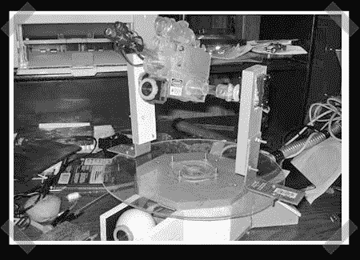

# 达斯优步气枪炮塔

> 原文：<https://hackaday.com/2008/08/21/das-uber-airsoft-gun-turret/>

紧随 [Wii 导弹发射器](http://www.hackaday.com/2008/08/15/wiimote-missle-launcher/)，[达斯优步气枪炮塔](http://www.instructables.com/id/Das_Uber_Airsoft_Gun_Turret/)而来，让我们过去的[气枪](http://www.hackaday.com/2007/01/14/airsoft-turret-2-0/) [炮塔](http://www.hackaday.com/2006/12/10/usb-airsoft-turret/)相形见绌。由[Miltron_B]制造，这个自主野兽不仅有华丽的 LED 指示灯，它还有激光器。他们三个。三台该死的激光器。花点时间擦一下下巴上的口水。

我们以前见过很多炮塔，但这一个在设计上确实很出色。它具有两个网络摄像头，用于更精确的检测和跟踪，当设置为手动模式时，它可以用 XBox 360 控制器控制。他上传了这个过程的精彩照片，并一步一步地分解。大量有用的链接可以帮助你。

应该有人为这个东西构造一个[传送门哨兵枪](http://www.youtube.com/watch?v=DAV8PhczbgE)的外壳，加上语音剪辑。

*   [永久链接](http://www.instructables.com/id/Das_Uber_Airsoft_Gun_Turret/)