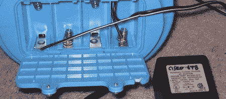

# 黑掉 Elefun

> 原文：<https://hackaday.com/2008/08/25/hacking-the-elefun/>

【氙】决定给[的一个孩子的玩具](http://xenon.arcticus.com/elefun-hella-fun-hacking-your-elefun-ele-fun-and-profit)加汤，这一举动让人想起《T2》家装的许多集。Elefun 是一种大象形状的玩具，它使用内置风扇将小蝴蝶吹向空中。他们是出了名的弱，疯狂吃电池。他们甚至没有墙上电源适配器的插头。

[Xenon]从一个旧的 DSL 调制解调器中翻出一个 7.5 V 的墙上适配器。由于 Elefun 通常使用 6V 电源，他认为这将为玩具提供急需的动力。当他意识到他可以将电线插入端子时，他开始打开东西并准备好烙铁。电池盒螺丝关闭，提供良好的防触电安全。

他给自己的小儿子带来了更加愉快的经历。Elefun 现在开始活跃起来，轻松地吐出蝴蝶。它实际上很快就把它们射出去了，他不得不多做一些，这样游戏才能持续更长时间。

这可能不是最复杂的黑客或最令人印象深刻的执行。[Xenon]值得表扬，他认识到了设计上的问题，并自己解决了这些问题。至少有一个 Elefun 在 Hack A Day 员工的家庭中会得到这种待遇。
【谢谢克里斯】

*   [永久链接](http://xenon.arcticus.com/elefun-hella-fun-hacking-your-elefun-ele-fun-and-profit)