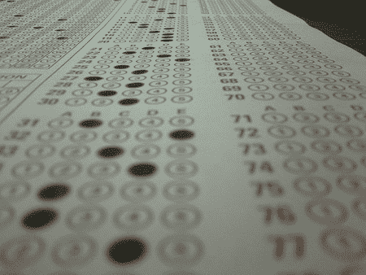

# 高中生黑掉电子试卷

> 原文：<https://hackaday.com/2008/08/27/high-school-students-hacking-electronic-tests/>

【阿历克斯·帕帕迪穆利斯】在高中写了关于独创性和[黑客](http://thedailywtf.com/Articles/When-In-Doubt,-Choose-C.aspx)的文章。在老师安装了一个新的电子笔记和考试软件后，学生们立即开始黑客攻击。他们想方设法找到了几种通过考试的方法，但没有一种方法涉及到前一天晚上努力学习。最终，老师们回到了旧系统来防止这种恶作剧。

[照片:[椰子](http://flickr.com/photos/cocoen/411960476/)

*   [永久链接](http://thedailywtf.com/Articles/When-In-Doubt,-Choose-C.aspx)