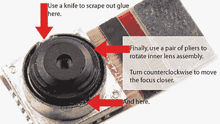

# 用 IPhone 进行微距摄影

> 原文：<https://hackaday.com/2008/08/28/macro-photography-with-an-iphone/>

[iPhone](http://www.mahalo.com/Iphone)上的相机镜头与任何其他相机镜头都很相似，因为镜头有固定的最小和最大焦距。如果你想离你的拍摄对象更近一点，你可能会想试试【伊斯特兰的】[微距相机模组](http://www.eastrain.com/?p=73)。

据[eastrain]报道，第一代和第二代 iPhone 相机都有一个螺旋型对焦环，在出厂时就已经粘合到无限远了。这可能是为了让 99%的照片大致对焦。

要接触到相机镜头，需要拆卸手机，这无疑会使您可能拥有的任何类型的保修失效。一旦镜头在视野中，你将需要打破 2 胶水点举行镜头在目前的位置。

使用尖嘴钳，您可以逆时针旋转镜头以增加变焦，或顺时针旋转以减少变焦。启用内置的相机应用程序可以让你实时看到你的变化。当你满意的时候，就把所有的东西放回原处。当然，下一步应该是一个外部安装的环，允许手动缩放。

*   [永久链接](http://www.eastrain.com/?p=73)