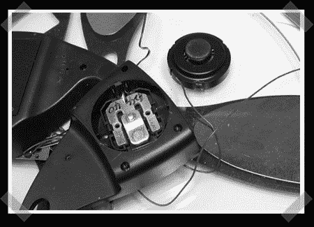

# 黑进一个秤来测试火箭发动机

> 原文：<https://hackaday.com/2008/08/29/hacking-a-scale-to-test-rocket-motors/>

【David Steeman】给了我们这个项目。他用一个消费者秤[测量火箭发动机推力](http://www.steeman.be/?p=192)。他希望能够绘制出自制火箭发动机的推力曲线，以确定它们是否符合设计目标。它通过微控制器测量火箭发动机施加的力，并将其记录在计算机的文本文件中。然后，他在 Excel 电子表格中分析这些数据。

传感器是从消费电子秤上获得的，而其余的电子产品是手工制造的。他使用的是 PIC 18F2550 微控制器，内置 USB 接口。他有每件作品的细目分类，详细说明了它是如何工作的，还有一些漂亮的图片。他还列出了未来需要改进的地方，比如提高采样速度，将其与点火系统集成，以及减小物理尺寸。原理图、固件和 excel 电子表格文件可在页面底部下载，请继续向下滚动。

*   [永久链接](http://www.steeman.be/?p=192)