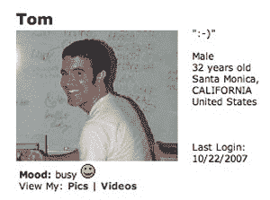

# MySpace 联合创始人汤姆·安德森曾是一名黑客

> 原文：<https://hackaday.com/2008/08/30/myspace-cofounder-tom-anderson-former-hacker/>

MySpace 的用户对他们的第一个“朋友”和 MySpace 的联合创始人汤姆·安德森非常熟悉，但是你有没有想过他在成为大家的朋友之前是做什么的？TechCrunch 的调查报告显示[【汤姆】是八十年代的一名黑客](http://www.techcrunch.com/2008/08/30/myspace-cofounder-tom-anderson-was-a-real-life-wargames-hacker-in-1980s/)入侵了大通银行的电脑系统，引起了联邦调查局的注意。他以“平头勋爵”为名，在 14 岁时成为了一个黑帽黑客组织的头目。他的活动(以及其他黑客的活动)导致了加州历史上最大的一次联邦调查局突袭。因为他当时是未成年人，所以没有被逮捕，而是被处以缓刑，以换取停止实施计算机犯罪的协议。这无疑让[汤姆·安德森]出现在你的好友名单上变得更有趣了，不是吗？

[via [Digg](http://digg.com/people/MySpace_Cofounder_was_a_real_life_hacker)

*   [永久链接](http://www.techcrunch.com/2008/08/30/myspace-cofounder-tom-anderson-was-a-real-life-wargames-hacker-in-1980s/)