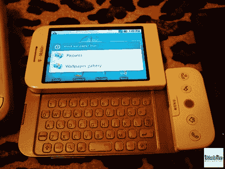

# HTC 梦想安卓手机

> 原文：<https://hackaday.com/2008/08/30/htc-dream-android-phone/>

Engadget 拥有一个[的全新 HTC 梦](http://www.engadget.com/2008/08/30/htcs-android-driven-dream-revealed-in-glorious-spy-photos/)的完整图库，首款运行 [Android](http://www.mahalo.com/Android "Android - Mahalo") 的量产手机。它将于今年秋天的某个时候在 [T-Mobile](http://www.mahalo.com/T_Mobile "T-Mobile - Mahalo") 上推出(尽管缺少了[的功能)。](http://www.hackaday.com/2008/08/26/key-features-cut-out-of-android-api/)

*   [永久链接](http://www.engadget.com/2008/08/30/htcs-android-driven-dream-revealed-in-glorious-spy-photos/)