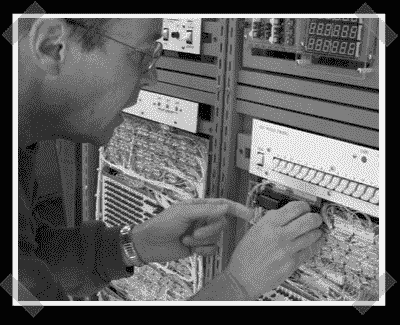

# 阿波罗制导计算机克隆

> 原文：<https://hackaday.com/2008/08/31/apollo-guidance-computer-clone/>

【克里夫·米勒】从 2004 年就指出了这个不可思议的项目。[John Pultorak]的旅程始于 2000 年末，当时他决定建造一台 60 或 70 年代的小型计算机。在收集技术文档时，他在[阿波罗制导计算机](http://klabs.org/history/build_agc/)上发现了一些有趣的信息，并觉得这是正确的做法。AGC 是有史以来第一台集成电路计算机。1964 年由麻省理工学院设计，它由大约 5000 个集成电路构成，几乎都是 3 输入或非门。[John]的版本使用 20 世纪 60 年代后期的 74LS TTL 逻辑，这使他的集成电路数量减少了 10 比 1。当您必须进行约 15K 绕线连接时，这是一件好事。他还使用触发器和寄存器芯片，而不是从或非门构建一切。[John]基本上构建了三次 AGC:首先，他用 C++编写了一个模拟器。然后，他将逻辑设计导入 CircuitMaker，以验证它是否真的可以工作。最后，他建造了一台 3x 5 英尺的机器。他为任何想要探索这款设备的人提供了数量惊人的文档，光是概述就非常值得一看。

*   [永久链接](http://klabs.org/history/build_agc/)