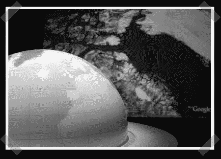

# 交互式全球显示

> 原文：<https://hackaday.com/2008/09/02/interactive-globe-display/>

【ERASME】为因纽特人和他们的土地的展览建造了这个[互动地球界面](http://reseau.erasme.org/Interactive-Globe-technical)。目标是有一个触觉输入设备谷歌地球数据。该设备由一个用于位置选择的半球、一个用于图层选择的触摸板和一个用于视图更改的 Wiimote 组成。他们不得不为谷歌地球开发自己的驾驶应用程序，因为没有为 [Linux](http://www.mahalo.com/Linux "Linux - Mahalo") 开发的应用程序。名为 KeyEvents 的软件从所有设备获取输入，并模仿谷歌地球中的键盘和鼠标控制。

还有更多关于他们如何让这些部件一起工作的信息，以及一些显示设备工作的法语视频。不过有一点很突出，他们决定在 Wiimote 上使用直接关联，从而阻止流氓 Wiimote 获得控制权。谁会带着 Wiimote 到处跑只是为了劫持公共展示？我们会的。

[谢谢无色]

*   [永久链接](http://reseau.erasme.org/Interactive-Globe-technical/)