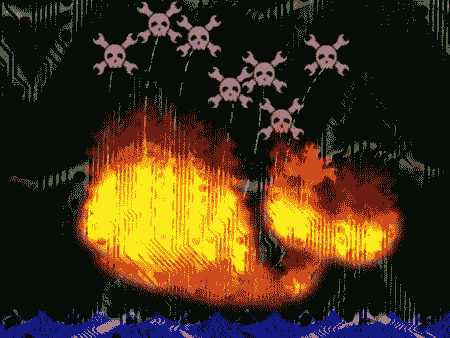

# 黑客日失败鲸鱼大赛

> 原文：<https://hackaday.com/2008/09/04/hack-a-day-fail-whale-contest/>

我们回来了！接下来的几天可能会有点奇怪。我们的失败鲸鱼比赛仍在进行，到目前为止我们已经收到了 100 多份参赛作品。以下是您的参与方式:

当我们给我们的服务器发电厂添加更多的仓鼠时，我们想举办一个小的艺术比赛。每当推特关闭时，他们就会发布标志性的失败鲸鱼。失败鲸变得如此受欢迎，以至于它催生了一个[专用博客](http://failwhale.com/)和许多许多艺术项目:[刺绣](http://flickr.com/photos/emdot/2628476582/)、[纹身](http://www.flickr.com/photos/korneliuz/2798668810/)和[激光切割模型](http://www.nycresistor.com/2008/08/24/rapid-prototyping-is-the-most-fun-ever/)。

我们想知道你认为黑客日失败是什么样子的。创作一幅插图、一张照片、一件雕塑，任何你认为能体现的东西。将您的作品发送到[hackaday.fail@gmail.com](mailto:hackaday.fail@gmail.com)并添加到 [Hack a Day 照片库](http://flickr.com/groups/hack-a-day/)。奖品是 100 美元，你可以在 [No Starch Press](http://nostarch.com/) 商店消费。参赛作品截止时间为 2008 年 9 月 6 日星期六 00:00PDT。

[图片: [Bjonnh](http://flickr.com/photos/30160281@N05/2825105411/in/pool-hack-a-day)