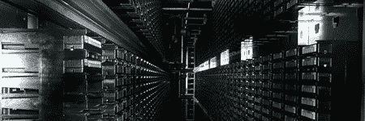

# 欢迎来到善待动物中心

> 原文：<https://hackaday.com/2008/09/05/welcome-to-the-petacenter/>

[科利·多克托罗]获得了几个处理 Pb 级存储的[数据中心的使用权](http://www.nature.com/news/2008/080903/full/455016a.html)。对数据存储和处理的需求没有任何停止的迹象。当人们不仅需要资源来管理像谷歌搜索这样的事情，还需要资源来管理电子邮件、客户交易，以及在 CERN 的情况下，管理物理计算时，这一点尤其重要。[多克托罗]从他在数据中心的经历中得出一个有趣的结论；在笔记本电脑或台式电脑的创新方面，Pb 中心的任何创新最终都会惠及普通用户。Pb 级的中心很容易用普通计算机用户可以买到的材料复制；唯一的障碍是价格和空间。

[via [Boing Boing](http://www.boingboing.net/2008/09/04/petascale-datacenter.html)