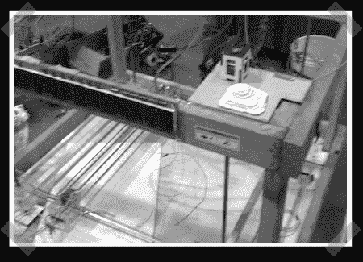

# 3D 矿物打印机

> 原文：<https://hackaday.com/2008/09/07/3d-mineral-printer/>

过去几天，许多人都在谈论南加州大学的轮廓打印机。这是一种打印混凝土轮廓的设备，希望最终能打印出整栋房子。卡特彼勒已决定支持该倡议。

这让我们想起了我们在创客大会上遇到的一个项目。[叶小开·艾姆斯]、[马修·鲍曼]、[玛丽德斯·阿塔纳西亚迪斯]和[特雷尔·爱德华兹]建造了一台 [3D 矿物打印机](http://rockprinter.com/)作为他们在加州大学圣克鲁斯分校的高级工程设计项目。打印机的工作原理是先铺上一层干混凝土粉末。然后，它选择性地润湿粉末，使其成为固体形态。反应不需要空气干燥，所以下一层可以立即应用。打印机只能创建轮廓，该团队设想这将用于创建临时铸模。建筑外壳将近一立方米。当我们与他们交谈时，他们正在试验许多不同类型的混合材料。休息之后是第一次测试的视频。